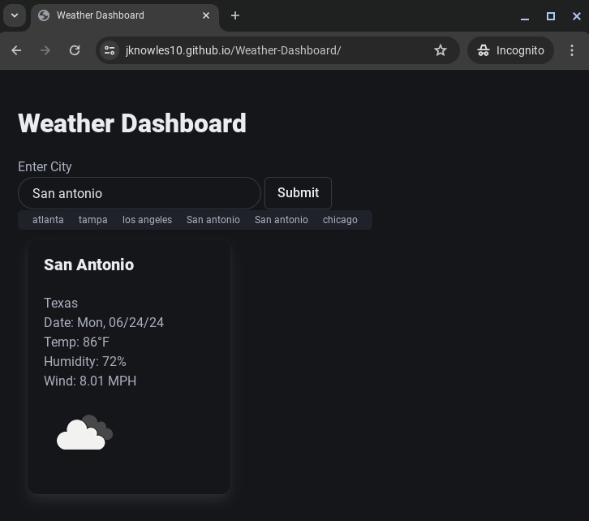
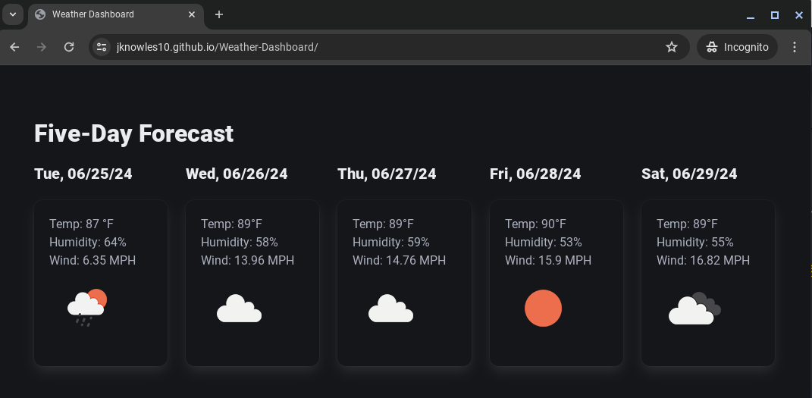

## Weather-Dashboard

## Description
This is a challenge assignment for UT Austin's Coding Bootcamp. This week we learned about Server Side APIs and the task was to build a weather dashboard that will show current and future weather conditions for a user-inputted city. The conditions should display the city name, temperature, humidity, wind speed and an icon depicting weather conditions. The searched city should be added to the user's search history.

## User Story
AS A traveler
I WANT to see the weather outlook for multiple cities
SO THAT I can plan a trip accordingly

## Acceptance Criteria
GIVEN a weather dashboard with form inputs
WHEN I search for a city
THEN I am presented with current and future conditions for that city and that city is added to the search history
WHEN I view current weather conditions for that city
THEN I am presented with the city name, the date, an icon representation of weather conditions, the temperature, the humidity, and the wind speed
WHEN I view future weather conditions for that city
THEN I am presented with a 5-day forecast that displays the date, an icon representation of weather conditions, the temperature, the wind speed, and the humidity
WHEN I click on a city in the search history
THEN I am again presented with current and future conditions for that city

## Usage
Please visit the following link to view the website:

Please visit the following link to view the repository: https://github.com/jknowles10/Weather-Dashboard

## Mock-Up

## License
MIT License

## Credits
CSS Framework:https://bulma.io/
API: https://openweathermap.org/api